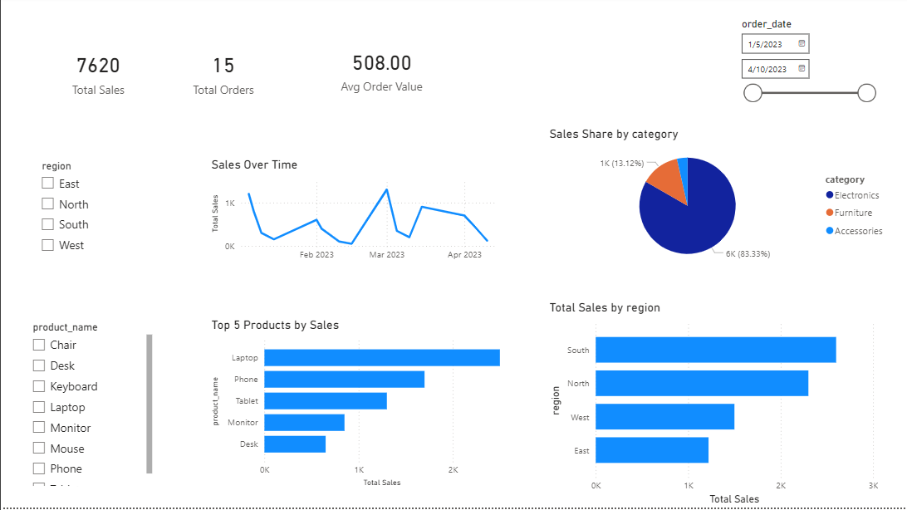

# Sales Dashboard with Power BI

## 📊 Project Overview
This project presents an interactive Power BI dashboard built to analyze sales performance and generate business insights.

The dashboard highlights key metrics, sales trends over time, top-performing products, and regional performance.

---

## 📁 Dataset
The dataset used (`sales.csv`) contains transactional sales data including:

- Order ID
- Order Date
- Product Name
- Category
- Region
- Sales Amount

---

## 📊 Dashboard Features

- 📌 Total Sales, Total Orders, Average Order Value (KPIs)
- 📈 Sales trend over time
- 🏆 Top 5 products by sales
- 🌍 Sales performance by region
- 🥧 Sales distribution by category
- 🎛 Interactive filters (region, product, date)

---

## 🛠 Tools Used
- Power BI
- DAX
- Data visualization

---

## 📸 Dashboard Preview

---

## 💡 Key Insights

- A small number of products generate most of the revenue
- Sales are concentrated in specific categories
- Certain regions outperform others consistently
- Sales trends fluctuate over time

---

## 🚀 Future Improvements

- Add more advanced DAX measures
- Connect to a live database
- Build a multi-page dashboard
- Integrate with Power BI Service

---

## 📌 Notes
This project is part of my Data Analyst portfolio.
